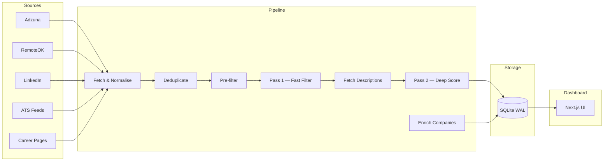
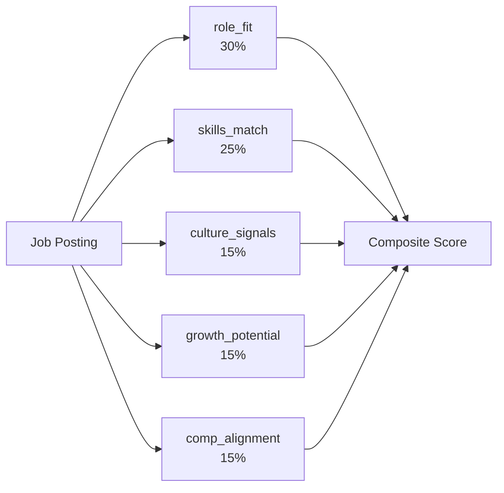

# jseeker

> An end-to-end job search pipeline that eliminates noise through deterministic pre-filtering and two-pass LLM scoring — built to demonstrate applied AI engineering at production scale.


---

## What It Does

The core problem with job searching at scale is signal-to-noise ratio. Fetching from five sources produces hundreds of postings per run; the overwhelming majority are misaligned on title, seniority, location, or compensation. Manually reviewing all of them is impractical.

jseeker solves this with a deterministic pre-filter stage that eliminates obvious non-fits cheaply — wrong location, red-flag keywords, stale postings — before any LLM is invoked. The surviving candidates go through a two-pass scoring pipeline: Pass 1 uses a lightweight prompt to fast-filter at scale; only Pass 1 survivors receive the expensive deep-analysis prompt in Pass 2, where each posting is scored across five weighted dimensions against a YAML profile. The result is a short, ranked list of roles worth actually reading, surfaced through a Next.js dashboard with scoring breakdowns, compensation comparisons, and profile evolution suggestions.

The pipeline also tracks how job requirements shift across runs and generates targeted suggestions for improving the candidate profile. The profile YAML is the single source of truth for preferences, salary thresholds, and seniority targeting — no magic constants scattered through the code.

---

## Architecture



---

## Key Technical Decisions

**Two-pass LLM scoring** — Pass 1 runs a lightweight prompt against every pre-filter survivor to eliminate obvious non-fits cheaply. Only Pass 1 survivors get the expensive deep-analysis prompt in Pass 2. This keeps LLM API costs proportional to the actual candidate pool, not the raw firehose.

**Profile evolution** — The scoring pipeline tracks how job requirements shift over time and generates profile improvement suggestions. The profile YAML is the single source of truth for preferences, salary thresholds, and seniority targeting — no magic constants scattered through the code.

**File-based scoring output** — Pass 2 scores are written to per-job files before being committed to the database. This makes individual scoring runs inspectable and re-runnable without re-hitting the LLM, and allows the subagent-based orchestration model to work reliably.

**WAL-mode SQLite** — Pipeline stages run concurrently (fetchers in parallel, enrichment alongside scoring). WAL mode lets readers and writers proceed without blocking each other, which matters when the dashboard is open during a pipeline run.

---

## Scoring Dimensions

Pass 2 scores each job across five weighted dimensions:



| Dimension | Weight | What it measures |
|---|---|---|
| `role_fit` | 30% | Title, seniority, and scope alignment with target role |
| `skills_match` | 25% | Overlap between job requirements and profile skills |
| `culture_signals` | 15% | Indicators of environment, autonomy, and working style |
| `growth_potential` | 15% | Learning opportunity, scope expansion, career trajectory |
| `comp_alignment` | 15% | Compensation signals relative to target and floor |

---

## Tech Stack

| Layer | Technology |
|---|---|
| Pipeline language | Python 3.10+ |
| LLM orchestration | Claude (via Anthropic API) |
| Database | SQLite (WAL mode) |
| Job sources | Adzuna, RemoteOK, LinkedIn (RapidAPI), ATS feeds, career page crawlers |
| Enrichment sources | Glassdoor (RapidAPI), Levels.fyi, StackShare |
| Dashboard | Next.js 16, TypeScript, Tailwind CSS |
| Testing | pytest (700+ tests) |
| Task runner | GNU Make |

---

## Getting Started

**Prerequisites**: Python 3.10+, Node.js 18+, and GNU Make.

```bash
# 1. Clone the repo
git clone https://github.com/c0rrey/jobseeker.git jseeker
cd jseeker

# 2. Create and activate a Python virtual environment (recommended)
python3 -m venv .venv && source .venv/bin/activate
# make setup works without a venv (installs globally), but a venv is strongly recommended.

# 3. Set up credentials
# Create a .env file in the repo root with your API keys:
#   ANTHROPIC_API_KEY=your-key-here
#   ADZUNA_APP_ID=your-app-id
#   ADZUNA_API_KEY=your-api-key
#   RAPIDAPI_KEY=your-rapidapi-key

# 4. Set up your search profile
cp pipeline/config/profile.yaml.example pipeline/config/profile.yaml
# Edit profile.yaml: title keywords, skills, salary targets, location preferences

# 5. Install dependencies and initialise the database
make setup && make db-reset

# 6. Run the pipeline
make all         # fetch → prefilter → enrich

# 7. Launch the dashboard
make web         # http://localhost:3000
```

Run the test suite:

```
$ make test
...
747 passed in 14.07s
```

### Makefile Targets

| Target | Description |
|---|---|
| `make venv` | Create a Python virtual environment at `.venv/` (activate with `source .venv/bin/activate`) |
| `make setup` | Install Python dependencies (`pip install`) and Node dependencies (`npm install`) |
| `make fetch` | Run all API fetchers, ATS feeds, and career page crawler |
| `make enrich` | Run the enrichment orchestrator on companies needing enrichment |
| `make prefilter` | Run the deterministic pre-filter on unfiltered jobs |
| `make all` | Run fetch, prefilter, and enrich in sequence |
| `make web` | Start the Next.js dev server at http://localhost:3000 |
| `make db-reset` | Delete and recreate the database with the current schema |
| `make test` | Run the Python test suite with pytest |

### Troubleshooting

| Symptom | Cause | Fix |
|---|---|---|
| `make setup` installs to system Python | No venv active | Run `python3 -m venv .venv && source .venv/bin/activate` before `make setup` |
| `make fetch` raises `ValueError` for Adzuna | Missing `ADZUNA_APP_ID` / `ADZUNA_API_KEY` in `.env` | Add valid Adzuna credentials to `.env` |
| `make fetch` logs a warning for LinkedIn | Missing `RAPIDAPI_KEY` in `.env` | Add a valid RapidAPI key to `.env` (LinkedIn fetcher degrades gracefully) |
| `make web` throws a database error | `data/jobs.db` does not exist | Run `make db-reset` before `make web` |
| `make db-reset` fails | Unexpected `sqlite3` error | Check Python path: `python3 -c "from pipeline.src.database import init_db"` |
| `python3 -m venv` not found | Python 3 not installed or aliased as `python` | Install Python 3.10+ and ensure `python3` is on `PATH`, or override with `PYTHON=python make setup` |

---

## Project Structure

```
jseeker/
├── pipeline/
│   ├── config/
│   │   ├── profile.yaml.example   # copy to profile.yaml and edit
│   │   ├── settings.py            # environment + config loading
│   │   └── red_flags.yaml         # deterministic filter rules
│   ├── prompts/                   # LLM prompt templates
│   ├── src/
│   │   ├── fetchers/              # Adzuna, RemoteOK, LinkedIn, ATS, career pages
│   │   ├── enrichment/            # Glassdoor, Levels.fyi, StackShare
│   │   ├── scorer.py              # two-pass LLM scoring engine
│   │   ├── profile_evolution.py   # profile improvement analysis
│   │   ├── deduplicator.py        # cross-source deduplication
│   │   ├── filter.py              # deterministic pre-filter
│   │   └── database.py            # SQLite (WAL mode) layer
│   ├── tests/                     # 700+ pytest tests
│   └── cli.py                     # pipeline CLI entry point
├── web/
│   ├── app/
│   │   ├── jobs/                  # job list + detail views
│   │   ├── companies/             # company detail pages
│   │   └── profile/               # profile evolution view
│   └── components/                # shared UI components
├── data/                          # SQLite database (git-ignored)
├── .env.example                   # credential template (not yet committed — create .env manually)
└── Makefile                       # task runner
```

---

## Screenshots

<!-- Dashboard overview: ranked job list with composite scores and source badges -->
<!--  -->

<!-- Job detail view: scoring breakdown across 5 dimensions with LLM reasoning -->
<!--  -->

<!-- Profile evolution page: skill gap analysis and improvement suggestions -->
<!--  -->
