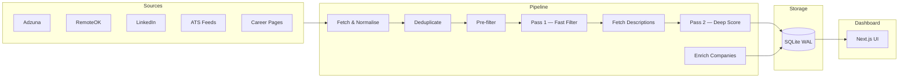
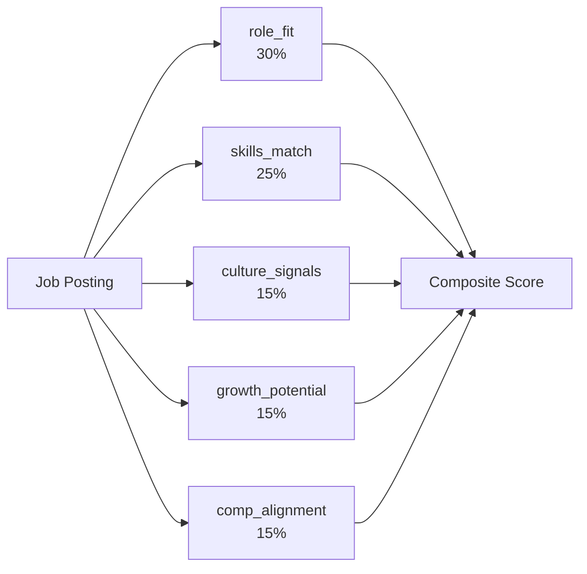

# jseeker

> An end-to-end job search pipeline I built to solve my own job search — and to demonstrate applied AI engineering.


I got tired of manually sifting through hundreds of job postings that clearly weren't a fit. So I built a pipeline that fetches from five sources, deduplicates, pre-filters with deterministic rules, then runs a two-pass LLM scorer against my profile — surfacing only the roles worth reading. The Next.js dashboard makes it easy to review, compare, and track.

---

## What It Does

- **Fetches** listings from Adzuna, RemoteOK, LinkedIn (RapidAPI), ATS feeds (Greenhouse, Lever, Ashby), and career page crawlers
- **Deduplicates** across sources using normalized title + company fingerprinting
- **Pre-filters** with deterministic rules (location, red flags, staleness)
- **Scores** with a two-pass LLM pipeline: Pass 1 fast-filters at scale; Pass 2 scores survivors across 5 weighted dimensions
- **Enriches** company data from Glassdoor, Levels.fyi, and StackShare
- **Presents** everything in a Next.js dashboard with scoring breakdowns, comp comparisons, and profile evolution suggestions

---

## Architecture



---

## Key Technical Decisions

**Two-pass LLM scoring** — Pass 1 runs a lightweight prompt against every pre-filter survivor to eliminate obvious non-fits cheaply. Only Pass 1 survivors get the expensive deep-analysis prompt in Pass 2. This keeps LLM API costs proportional to the actual candidate pool, not the raw firehose.

**Profile evolution** — The scoring pipeline tracks how job requirements shift over time and generates profile improvement suggestions. The profile YAML is the single source of truth for preferences, salary thresholds, and seniority targeting — no magic constants scattered through the code.

**File-based scoring output** — Pass 2 scores are written to per-job files before being committed to the database. This makes individual scoring runs inspectable and re-runnable without re-hitting the LLM, and allows the subagent-based orchestration model to work reliably.

**WAL-mode SQLite** — Pipeline stages run concurrently (fetchers in parallel, enrichment alongside scoring). WAL mode lets readers and writers proceed without blocking each other, which matters when the dashboard is open during a pipeline run.

---

## Scoring Dimensions

Pass 2 scores each job across five weighted dimensions:



| Dimension | Weight | What it measures |
|---|---|---|
| `role_fit` | 30% | Title, seniority, and scope alignment with target role |
| `skills_match` | 25% | Overlap between job requirements and profile skills |
| `culture_signals` | 15% | Indicators of environment, autonomy, and working style |
| `growth_potential` | 15% | Learning opportunity, scope expansion, career trajectory |
| `comp_alignment` | 15% | Compensation signals relative to target and floor |

---

## Tech Stack

| Layer | Technology |
|---|---|
| Pipeline language | Python 3.10+ |
| LLM orchestration | Claude (via Anthropic API) |
| Database | SQLite (WAL mode) |
| Job sources | Adzuna, RemoteOK, LinkedIn (RapidAPI), ATS feeds, career page crawlers |
| Enrichment sources | Glassdoor (RapidAPI), Levels.fyi, StackShare |
| Dashboard | Next.js 15, TypeScript, Tailwind CSS |
| Testing | pytest (700+ tests) |
| Task runner | GNU Make |

---

## Getting Started

```bash
# 1. Clone the repo
git clone https://github.com/c0rrey/jobseeker.git jseeker
cd jseeker

# 2. Set up credentials
cp .env.example .env
# Edit .env with your API keys (Anthropic, Adzuna, RapidAPI, etc.)

# 3. Set up your search profile
cp pipeline/config/profile.yaml.example pipeline/config/profile.yaml
# Edit profile.yaml: title keywords, skills, salary targets, location preferences

# 4. Install dependencies and initialise the database
make setup
make db-reset

# 5. Run the pipeline
make all         # fetch → deduplicate → pre-filter → enrich
# Scoring runs via Claude Code subagents (see pipeline/prompts/)

# 6. Launch the dashboard
make web         # http://localhost:3000
```

Run the test suite:

```
$ make test
...
716 passed in 12.43s
```

---

## Project Structure

```
jseeker/
├── pipeline/
│   ├── config/
│   │   ├── profile.yaml.example   # copy to profile.yaml and edit
│   │   ├── settings.py            # environment + config loading
│   │   └── red_flags.yaml         # deterministic filter rules
│   ├── prompts/                   # LLM prompt templates
│   ├── src/
│   │   ├── fetchers/              # Adzuna, RemoteOK, LinkedIn, ATS, career pages
│   │   ├── enrichment/            # Glassdoor, Levels.fyi, StackShare
│   │   ├── scorer.py              # two-pass LLM scoring engine
│   │   ├── profile_evolution.py   # profile improvement analysis
│   │   ├── deduplicator.py        # cross-source deduplication
│   │   ├── filter.py              # deterministic pre-filter
│   │   └── database.py            # SQLite (WAL mode) layer
│   ├── tests/                     # 700+ pytest tests
│   └── cli.py                     # pipeline CLI entry point
├── web/
│   ├── app/
│   │   ├── jobs/                  # job list + detail views
│   │   ├── companies/             # company detail pages
│   │   └── profile/               # profile evolution view
│   └── components/                # shared UI components
├── data/                          # SQLite database (git-ignored)
├── .env.example                   # credential template
└── Makefile                       # task runner
```

---

## Screenshots

<!-- Dashboard overview screenshot -->
<!--  -->

<!-- Job detail view screenshot -->
<!--  -->

<!-- Profile evolution page screenshot -->
<!--  -->
